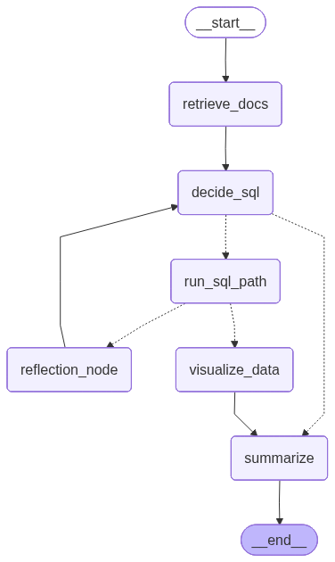

## 🧠 Agentic RAG LangGraph Architecture

This diagram illustrates the **agentic control flow** of the RAG system built using **LangGraph**.

The pipeline begins at `__start__`, where the user query enters the system.  
Relevant documents are first retrieved via `retrieve_docs`, combining vector search over embedded CSVs and documents.

The `decide_sql` node acts as an **intent router**, determining whether the query requires:
- purely semantic retrieval, or  
- structured computation using SQL.

If computation is required, execution moves to `run_sql_path`, where SQL is dynamically generated, sanitized, and executed against DuckDB.  
Quantitative results can optionally flow into `visualize_data` for chart generation.

A `reflection_node` enables self-correction and retry logic when SQL execution or reasoning fails, allowing the system to loop back intelligently instead of terminating early.

Finally, all successful paths converge at `summarize`, where retrieved context, computed results, and visual insights are synthesized into a grounded natural-language response before reaching `__end__`.

This architecture demonstrates **agentic decision-making, conditional execution, self-healing logic, and hybrid RAG + SQL reasoning** in a single unified workflow.

## Project Strcuture and Core Components
Code/
├── api.py
├── app_langgraph.py
├── ingestion.py
├── intent_llm.py
├── llm_sql_agent.py
├── pdf_to_markdown.py
├── sql_engine.py
├── sql_orchestrator.py
├── summarization_agent.py
├── tests_logger.py
├── ui.py
├── vectorize.py

eval/
├── eval_questions.jsonl
├── run_eval.py
├── score_ragas.py
