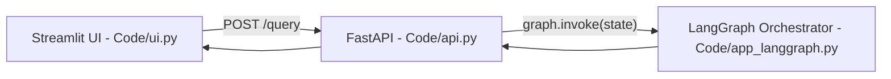
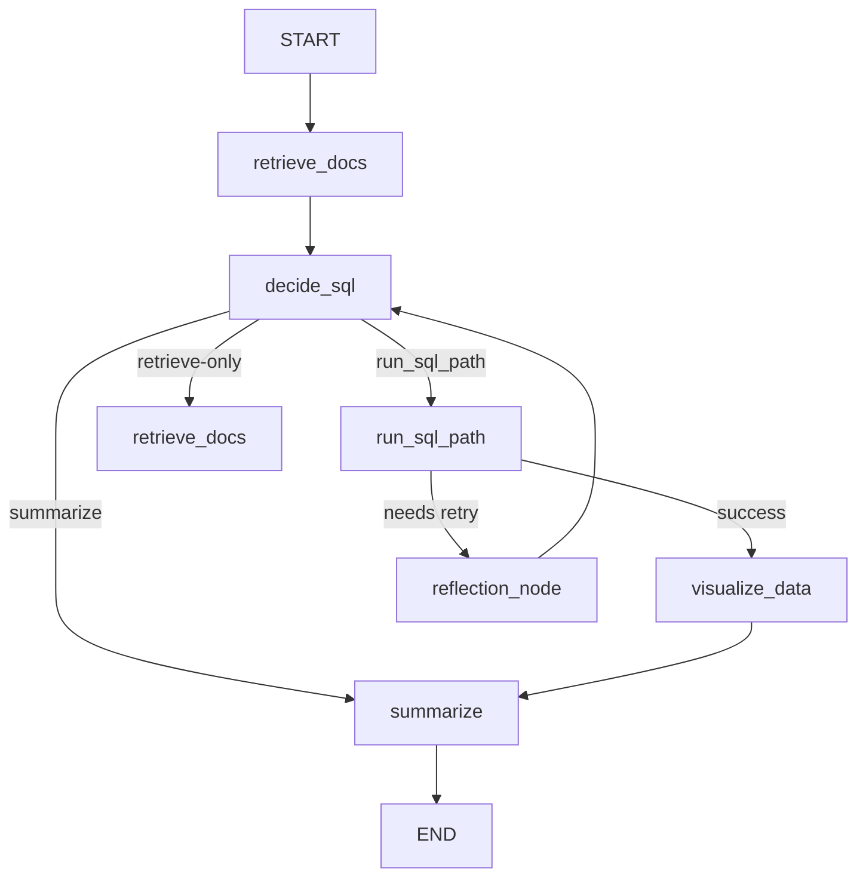
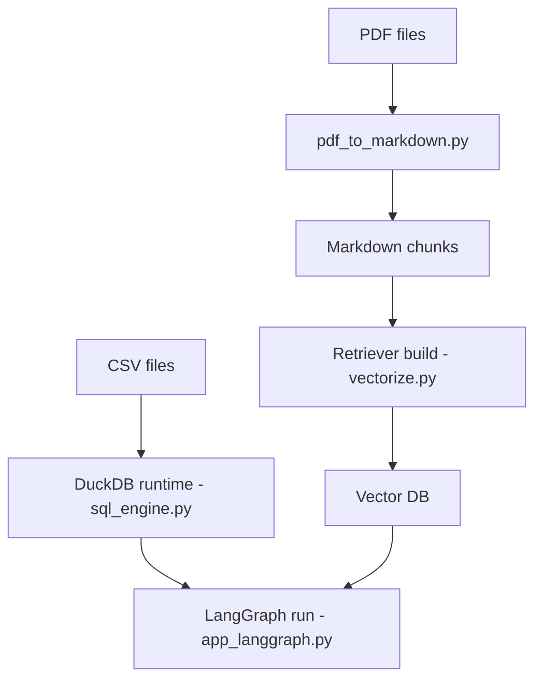
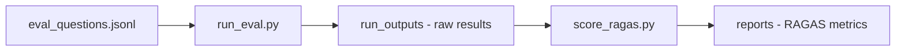
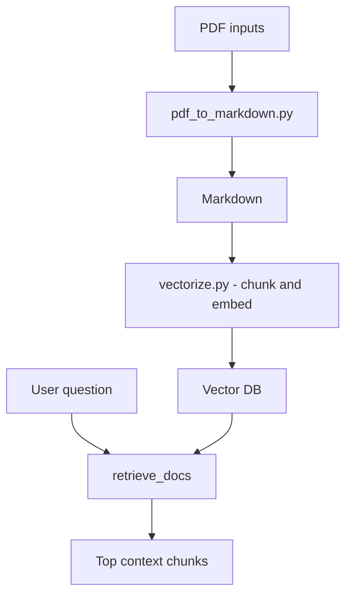
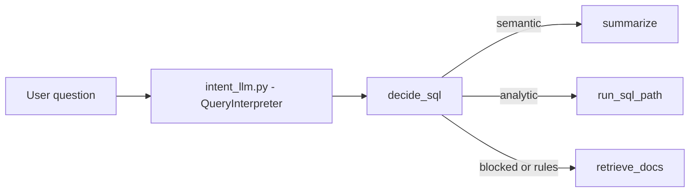
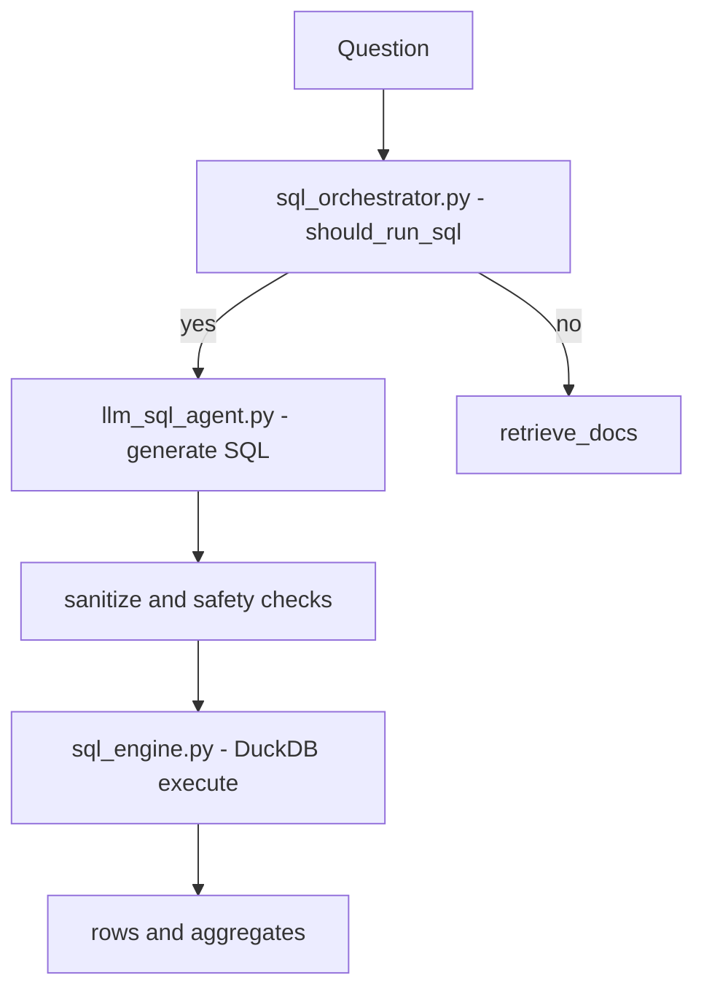
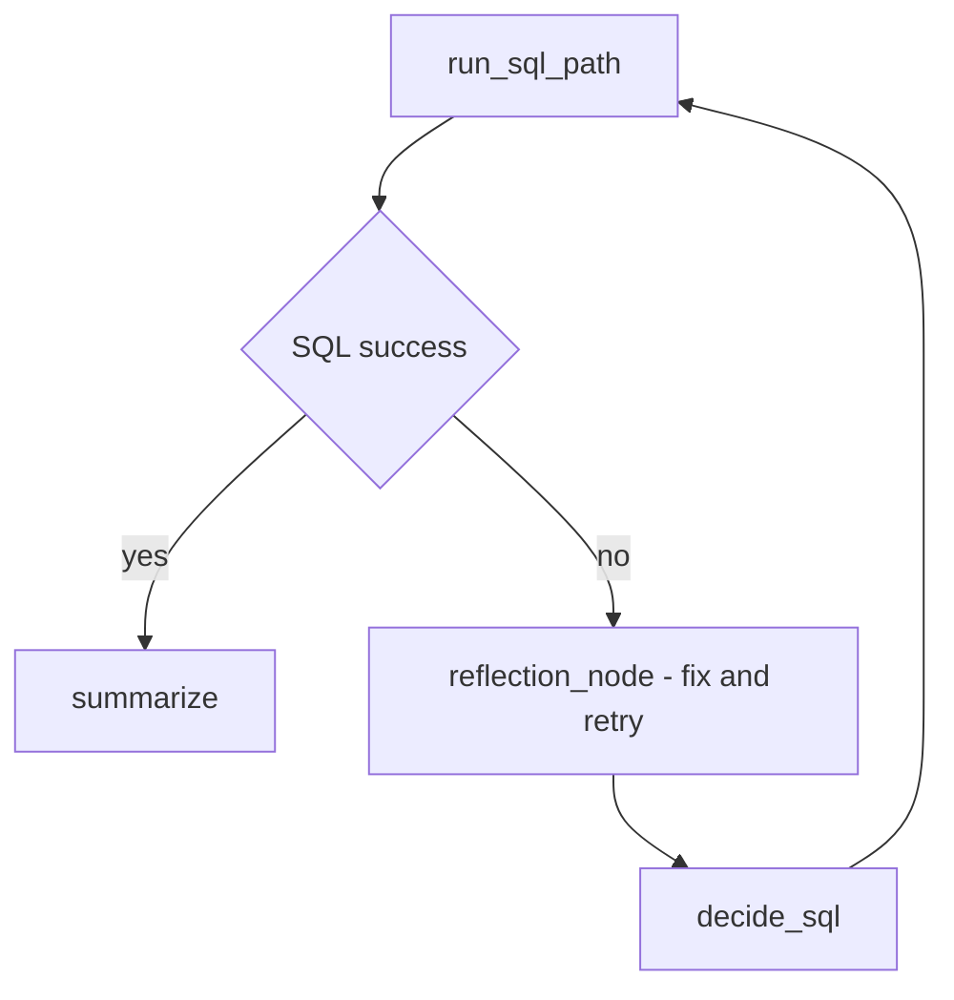
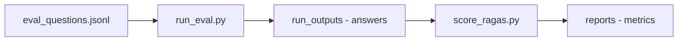

## 🧠 Agentic RAG LangGraph Architecture


This diagram illustrates the **agentic control flow** of the RAG system built using **LangGraph**.

The pipeline begins at `__start__`, where the user query enters the system.  
Relevant documents are first retrieved via `retrieve_docs`, combining vector search over embedded CSVs and documents.

The `decide_sql` node acts as an **intent router**, determining whether the query requires:
- purely semantic retrieval, or  
- structured computation using SQL.

If computation is required, execution moves to `run_sql_path`, where SQL is dynamically generated, sanitized, and executed against DuckDB.  
Quantitative results can optionally flow into `visualize_data` for chart generation.

A `reflection_node` enables self-correction and retry logic when SQL execution or reasoning fails, allowing the system to loop back intelligently instead of terminating early.

Finally, all successful paths converge at `summarize`, where retrieved context, computed results, and visual insights are synthesized into a grounded natural-language response before reaching `__end__`.

This architecture demonstrates **agentic decision-making, conditional execution, self-healing logic, and hybrid RAG + SQL reasoning** in a single unified workflow.


## Project Strcuture and Core Components
```text
Code/
├── api.py
├── app_langgraph.py
├── ingestion.py
├── intent_llm.py
├── llm_sql_agent.py
├── pdf_to_markdown.py
├── sql_engine.py
├── sql_orchestrator.py
├── summarization_agent.py
├── tests_logger.py
├── ui.py
├── vectorize.py
```


## ⚙️ Core Application Modules (`Code/`)

### `app_langgraph.py` — Agentic Control Plane
Defines the **LangGraph state machine** that orchestrates the entire RAG workflow.  
Handles conditional routing, retries, and convergence into final response generation.

> Think of this as the **brain** of the system.

---

### `ingestion.py` — Data & Document Ingestion
Responsible for loading CSVs, validating schemas, and preparing raw inputs for downstream processing.

---

### `vectorize.py` — Embedding & Retrieval Layer
- Chunks documents  
- Generates embeddings  
- Builds and queries the vector database  

Used during semantic retrieval phases of RAG.

---

### `intent_llm.py` — Query Intent Classification
Determines **user intent** (semantic lookup vs. analytical computation).  
This drives the routing logic inside LangGraph.

---

### `sql_orchestrator.py` — SQL Decision Logic
Decides **if SQL should run** and enforces safety rules before execution.

---

### `llm_sql_agent.py` — SQL Generation & Execution
- Generates SQL via LLM  
- Sanitizes queries  
- Executes against DuckDB  
- Returns structured results  

This enables **LLM-driven analytics**, not just retrieval.

---

### `sql_engine.py` — DuckDB Execution Layer
Low-level SQL execution utilities and dataframe handling.

---

### `pdf_to_markdown.py` — Document Normalization
Converts PDFs into clean Markdown for embedding and retrieval.

---

### `summarization_agent.py` — Final Answer Synthesis
Combines:
- Retrieved documents  
- SQL results  
- Optional visual insights  

into a grounded natural-language response.

---

### `tests_logger.py` — Observability & Debugging
Captures intermediate outputs, retries, and failures for inspection and evaluation.

---

### `ui.py` — User Interface Layer
Handles user interaction (CLI / lightweight UI), acting as the system entry point.

---

## Visual Representations 

### 1) End-to-end request flow (UI → API → LangGraph)


### 2) LangGraph core routing

### 3) Runtime build (CSV + PDFs → DuckDB + Retriever)


### 4) Evaluation pipeline (questions → runs → RAGAS report)



## Cluster-level mini Mermaids

### 5) Retrieval subsystem



### 6) Intent + routing subsystem


## 7) SQL analytics subsystem

## 8) Self-healing loop



## 9) Eval subsystem



## 📊 Evaluation Pipeline (`eval/`)

### `eval_questions.jsonl`
A structured set of evaluation prompts used to benchmark system performance.

---

### `run_eval.py` — Automated Evaluation Runner
Executes evaluation questions end-to-end through the LangGraph pipeline.

---

### `score_ragas.py` — RAGAS Scoring
Computes **RAGAS metrics** (faithfulness, relevance, answer correctness) to quantitatively assess RAG quality.
